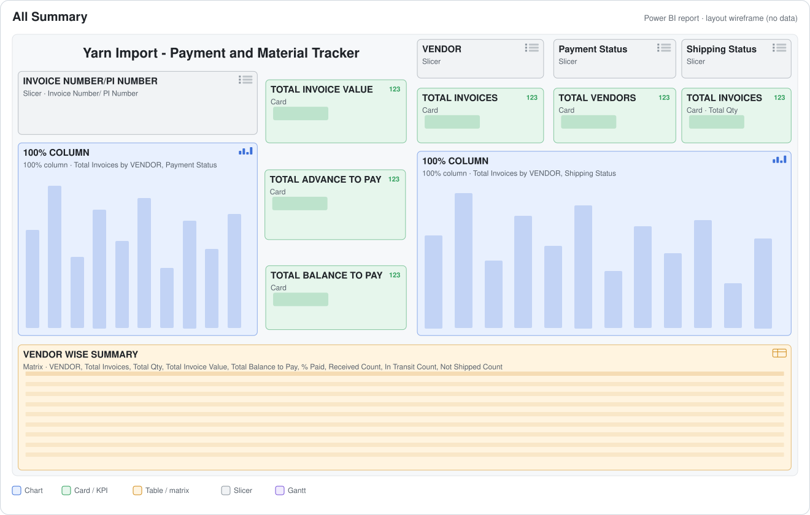
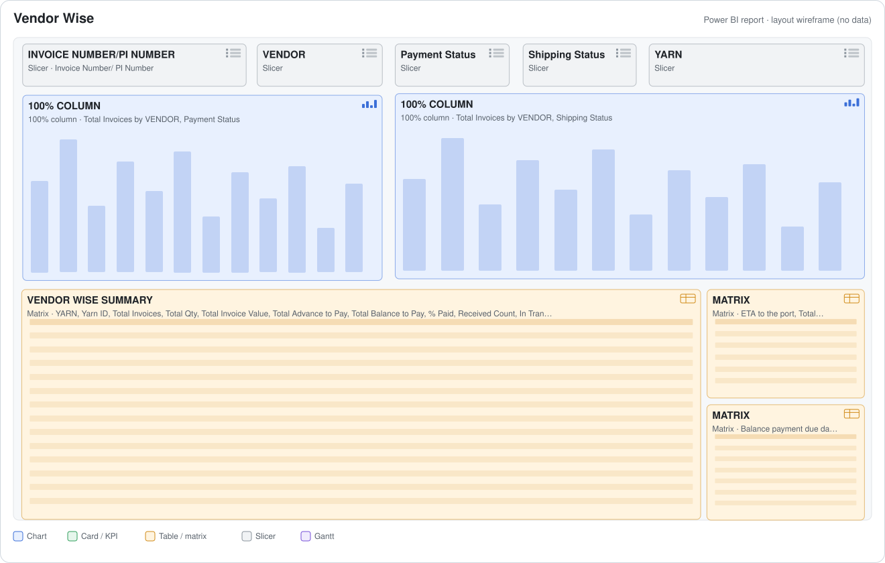

# Yarn Import — Payment & Shipment Tracker — Power BI

**One view of every imported-yarn invoice: how much has been paid, what balance is due and when, which containers are shipped, in transit or received, and the duty expected at the port. Built for purchase and finance to work from the same numbers.**


<p align="center"></p>

> Built for a knitted-apparel manufacturer. The report runs on live company data, so the `.pbix` and its data are not published. Page images are layout wireframes generated from the report definition, and the DAX is exported from the model.

---

## The problem

Imported yarn is bought on proforma invoices with an advance and a balance payment, and ships in containers that move through booked, shipped, in transit and received. Purchase and finance record all of this in one shared sheet, but a sheet cannot quickly answer *"what do we owe, by when, for which yarn, and what is still at sea?"*

## What the report does

- Reads the shared tracker sheet (invoice / PI, PO, vendor, yarn, quantity, cost, advance %, due dates, ETD / ETA, container and B/L, payment status, shipping status, duty value) and cleans it in Power Query.
- **KPIs:** total invoice value, invoices, vendors, quantity (kg), advance to pay, balance to pay, % paid, duty.
- **Counts invoices correctly:** one invoice can span several containers, so an invoice is counted as a distinct *(container, invoice)* pair, not as a row.
- **Status mix by vendor:** 100%-stacked payment status and shipping status.
- **Cash planning:** balance due by due date, and duty by port ETA.
- A **type-mismatch error query** lists any sheet rows whose values do not match the column types, so the owner can fix them.
- The in-transit and not-shipped yarn quantities from this tracker feed the **net buying quantity** in the [fabric planning report](https://github.com/Sharmaji12369/fabric-planning-power-bi).

## Report pages

| Page | Answers | |
|---|---|---|
| **All Summary** | KPI cards, payment and shipping status by vendor, vendor-wise summary (invoices, qty, value, balance, % paid, received / in-transit / not-shipped counts) | [layout](docs/pages/01-all-summary.svg) |
| **Vendor Wise** | Yarn-wise matrix per vendor, duty value by ETA, balance payable by due date | [layout](docs/pages/02-vendor-wise.svg) |

<details>
<summary>Show the Vendor Wise page layout</summary>


</details>

## DAX highlights

```dax
Total Invoices =                               -- an invoice split over containers counts once per container
COUNTROWS ( SUMMARIZE ( YarnInvoices, YarnInvoices[Container Unique ID], YarnInvoices[Invoice Number/ PI Number] ) )

Amount Paid  = [Total Invoice Value] - [Total Balance to Pay]
% Paid       = DIVIDE ( [Amount Paid], [Total Invoice Value], 0 )

In Transit Count =
CALCULATE (
    COUNTROWS ( SUMMARIZE ( YarnInvoices, YarnInvoices[Container Unique ID], YarnInvoices[Invoice Number/ PI Number] ) ),
    YarnInvoices[Shipping Status] = "Shipped Intransit"
)
```
All 12 measures: [`dax/model.dax`](dax/model.dax).

## Model at a glance

| | |
|---|---|
| Report pages | 2 · 24 visuals |
| Tables | 1 fact table + error-check query |
| DAX | 12 measures · 1 calculated column |
| Source | Google Sheets (shared purchase / finance tracker) |

## Skills demonstrated

`Power BI` `DAX (SUMMARIZE-based distinct counts, CALCULATE filters)` `Power Query data-quality checks` `Procurement & import finance` `KPI design`

---
<sub>Author: <a href="https://github.com/Sharmaji12369">Srijan Sharma</a> · Data & BI Analyst. Shared as a portfolio piece; the report, data and internal references belong to the employer and are not included.</sub>
